# automatic-mini-car with esp32-cam
# 智能小车


## 小车运动


### Arduino

#### 下载

##### 方法1：

Arduino 官网：[Software | Arduino](https://www.arduino.cc/en/software)

##### 方法2（推荐）：

> path:\work\SETTING\arduino-1.8.16-windows.exe

版本: arduino-1.8.16-windows

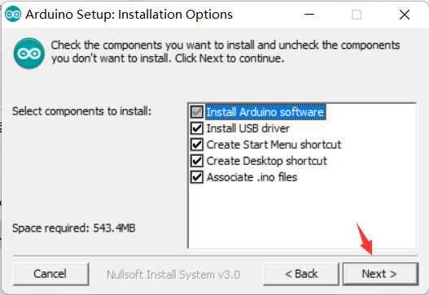
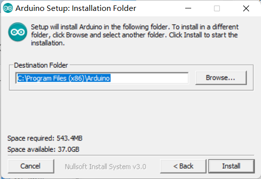

#### 配置ESP32开发环境

##### 方法1：

①文件>>首选项>>附加开发板管理器网址：https://dl.espressif.com/dl/package_esp32_index.json

②工具>>开发板>>开发板管理器>>esp32（选择版本进行安装）


##### 方法2（推荐）：

> path:\work\SETTING\arduino_conf

两个文件夹 ：AppData； Program Files (x86)

**AppData**

将`AppData\Local\Arduino15`中的文件覆盖到`C:\Users\ZXH\AppData\Local\Arduino15`中

`C:\Users\ZXH`可能无法查看到AppData文件夹。点击右上角查看勾选隐藏的项目即可

**Program Files (x86)**

将`Program Files (x86)\AppData`文件夹覆盖`C:\Program Files (x86)\AppData`文件夹

将`Program Files (x86)\Arduino`文件夹覆盖`C:\Program Files (x86)\Arduino`文件夹


### 运动

> path:\work\MOTION

#### 前进

##### 方法1：PWM控制电机

PWM

- frequency（频率）

 frequency = n

周期 T = $\frac{1}{n}$ 

eg: frequency = 50 Hz

​		T = 0.02s

- resolution（分辨率，占空比精度）

eg: resolution = 8 ($2^8$=256)

占空比取值0~255

- duty_cycle（占空比）

占空比 =  $\frac{高电平}{周期}$

所以通过控制**调整占空比**就能控制PWM信号从而能过**控制电机的转速**或者是**控制LED灯的亮度**，亦或是**控制舵机的旋转角度**


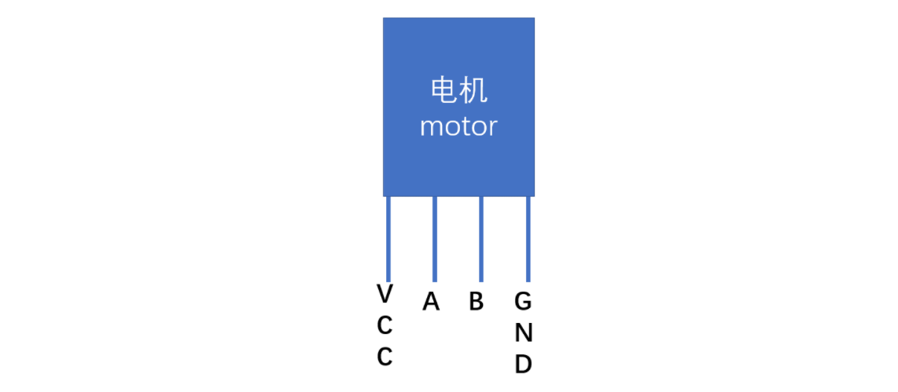


A，B 接收PWM信号

- channel（16个通道）

A:LOW 	 B:HIGH   A---->>>B

A:HIGH	  B:LOW   A<<<----B

A:HIGH 	 B:HIGH   A---------B

A:LOW  	 B:LOW   A<<<>>>B


```c++
// PWM控制电机
// path:\work\MOTION\PWM_FORWARD\PWM_FORWARD.ino
const int a = 26;
const int b = 27;
// pwm信号设置
// 频率 2000Hz
const int frequency = 2000;
// 分辨率（精确度） 8 2^8=256
const int resolution = 8;
// 16个信号通道 
const int channel_a = 0;
const int channel_b = 1;
// 占空比（7~32）
const int duty_cycle = 128;

void setup(){
  ledcSetup(channel_a,frequency,resolution);
  ledcAttachPin(a,channel_a);
  ledcSetup(channel_b,frequency,resolution);
  ledcAttachPin(b,channel_b);
}

void loop(){
  ledcWrite(channel_a,duty_cycle);
  ledcWrite(channel_b,0);
  delay(10000);
}
```


##### 方法2：MCPWM控制电机


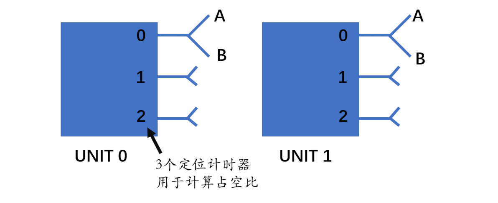


```c++
// MCPWM控制电机
// path:\work\MOTION\MCPWM_FORWARD\MCPWM_FORWARD.ino
#include "driver/mcpwm.h"

void setup(){
  // motor
  // 用选定的MCPWM_UNIT_0来初始化gpio口
  mcpwm_gpio_init(MCPWM_UNIT_0,MCPWM0A,26);
  mcpwm_gpio_init(MCPWM_UNIT_0,MCPWM0B,27);
  // 通过mcpwm_config_t结构体为定时器设置频率和初始值
  mcpwm_config_t motor_pwm_config = {
    .frequency = 1000, // .frequency = 1000 -- motor_pwm_config.frequency = 1000
    .cmpr_a = 0,  // a 的占空比--%
    .cmpr_b = 0,  // b 的占空比--%
    .duty_mode = MCPWM_DUTY_MODE_0,   // 占空比模式（高电平）
    .counter_mode = MCPWM_UP_COUNTER, // 计数器模式（上位计数）
  };
  // 使用以上设置配置PWM0A和PWM0B
  mcpwm_init(MCPWM_UNIT_0, MCPWM_TIMER_0, &motor_pwm_config);
}

void loop(){
  // motor
  // 前进
  mcpwm_set_duty(MCPWM_UNIT_0, MCPWM_TIMER_0, MCPWM_OPR_A, 100);  // 设置占空比（mcpwm单元,定时器,操控A,占空比%）
  mcpwm_set_duty(MCPWM_UNIT_0, MCPWM_TIMER_0, MCPWM_OPR_B, 0);
}
```


#### 后退

##### 方法1：PWM控制电机

```c++
// PWM控制电机
// path:\work\MOTION\PWM_BACK\PWM_BACK.ino
const int a = 26;
const int b = 27;
// pwm信号设置
// 频率 2000Hz
const int frequency = 2000;
// 分辨率（精确度） 8 2^8=256
const int resolution = 8;
// 16个信号通道 
const int channel_a = 0;
const int channel_b = 1;
// 占空比（7~32）
const int duty_cycle = 128;

void setup(){
  ledcSetup(channel_a,frequency,resolution);
  ledcAttachPin(a,channel_a);
  ledcSetup(channel_b,frequency,resolution);
  ledcAttachPin(b,channel_b);
}

void loop(){
  ledcWrite(channel_b,duty_cycle);
  ledcWrite(channel_a,0);
  delay(10000);
}
```


##### 方法2：MCPWM控制电机

```c++
// MCPWM控制电机
// path:\work\MOTION\MCPWM_BACK\MCPWM_BACK.ino
#include "driver/mcpwm.h"

void setup(){
  // motor
  // 用选定的MCPWM_UNIT_0来初始化gpio口
  mcpwm_gpio_init(MCPWM_UNIT_0,MCPWM0A,26);
  mcpwm_gpio_init(MCPWM_UNIT_0,MCPWM0B,27);
  // 通过mcpwm_config_t结构体为定时器设置频率和初始值
  mcpwm_config_t motor_pwm_config = {
    .frequency = 1000, // .frequency = 1000 -- motor_pwm_config.frequency = 1000
    .cmpr_a = 0,  // a 的占空比--%
    .cmpr_b = 0,  // a 的占空比--%
    .duty_mode = MCPWM_DUTY_MODE_0,   // 占空比模式（高电平）
    .counter_mode = MCPWM_UP_COUNTER, // 计数器模式（上位计数）
  };
  // 使用以上设置配置PWM0A和PWM0B
  mcpwm_init(MCPWM_UNIT_0, MCPWM_TIMER_0, &motor_pwm_config);
}

void loop(){
  // motor
  // 后退
  mcpwm_set_duty(MCPWM_UNIT_0, MCPWM_TIMER_0, MCPWM_OPR_A, 0);  // 设置占空比（mcpwm单元,定时器,操控A,占空比%）
  mcpwm_set_duty(MCPWM_UNIT_0, MCPWM_TIMER_0, MCPWM_OPR_B, 100);
}
```


#### 左转/右转/直行

##### PWM/MCPWM控制舵机


- PWM

channel = 0

frequency = 50 (T=0.02s=20ms)

resolution = 8


0.5ms--->>>0°			1ms--->>>45°		1.5ms--->>>90°

2ms--->>>135°			2.5ms--->>>180°

占空比

0°

$\frac{0.5}{20}$ = 2.5%


256*2.5% = 6.4 $\approx$ 7

90°

$\frac{1.5}{20}$ = 7.5%

256* 7.5% = 19.2 $\approx$ 20

180°

$\frac{2.5}{20}$ = 12.5%

256*12.5% = 32


- MCPWM

0°: $\frac{0.5}{20}$ = 2.5%

90°: $\frac{1.5}{20}$ = 7.5%

180°: $\frac{2.5}{20}$ = 12.5%


##### MCPWM控制电机

```c++
// MCPWM控制电机
// path:\work\MOTION\MCPWM_DIRECTION\MCPWM_DIRECTION.ino
#include "driver/mcpwm.h"

void setup(){
  // servo
  Serial.begin(115200);
  // 用选定的MCPWM_UNIT_1来初始化gpio口
  mcpwm_gpio_init(MCPWM_UNIT_1,MCPWM1A,13);
  // 通过mcpwm_config_t结构体为定时器设置频率和初始值
  mcpwm_config_t servo_pwm_config;
  servo_pwm_config.frequency = 50;
  servo_pwm_config.cmpr_a = 0; // a 的占空比--%
  servo_pwm_config.duty_mode = MCPWM_DUTY_MODE_0;   // 占空比模式（高电平）
  servo_pwm_config.counter_mode = MCPWM_UP_COUNTER; // 计数器模式（上位计数）
  // 使用以上设置配置PWM1A
  mcpwm_init(MCPWM_UNIT_1, MCPWM_TIMER_1, &servo_pwm_config);
}

void loop(){
  Serial.println("Setting servo pwm success!");
  // servo
  // mcpwm_stop(MCPWM_UNIT_1, MCPWM_TIMER_1);
  // 直行
  mcpwm_set_duty(MCPWM_UNIT_1, MCPWM_TIMER_1, MCPWM_OPR_A, 7.5);  // 设置占空比（mcpwm单元,定时器,操控A,占空比% （2.5%~12.5%））90度
  delay(2000);
  // 左转
  mcpwm_set_duty(MCPWM_UNIT_1, MCPWM_TIMER_1, MCPWM_OPR_A, 2.5); // 0度 2.5%
  delay(2000);
  // 直行
  mcpwm_set_duty(MCPWM_UNIT_1, MCPWM_TIMER_1, MCPWM_OPR_A, 7.5); // 90度 7.5%
  delay(2000);
  // 右转
  mcpwm_set_duty(MCPWM_UNIT_1, MCPWM_TIMER_1, MCPWM_OPR_A, 12.5); // 180度 12.5%
  delay(2000);
}
```


#### 整合

```c++
// path:\work\CAR_FUNCTION\CAR_FUNCTION.ino
```


# 智能小车采集数据


## 一、工作目的

实现通过网站遥控小车，并利用摄像头对地图进行拍照，采集相关数据。

## 二、具体步骤

### 1、安装摄像头

摄像头上有一个USB接口，将摄像头连接，在插入数据线的同时，将SD卡取出。

$\textcolor{red}{因为芯片在执行程序的时候，可能会同时去读取SD卡，从而造成芯片处于一个繁忙的状态，后续我们烧取程序时可能会报错。}$

$\textcolor{red}{切记要修改为摄像头对应的端口}$

### 2、编写程序1（手机热点）

#### 1、打开示例

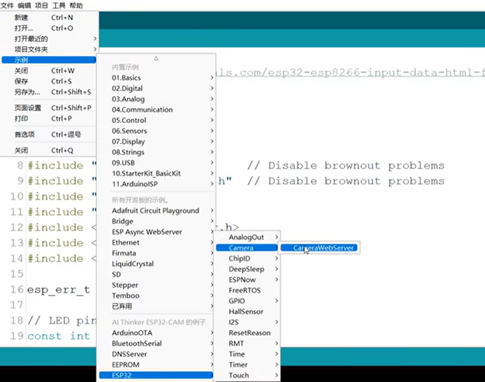

#### 2、修改示例

##### 1、修改AI__THINKER模块

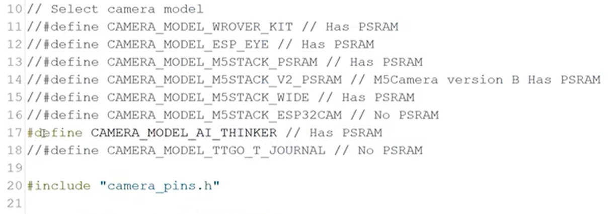


##### 2、将ssid,password修改为相应的配置

比如更改为手机热点的名称，和密码

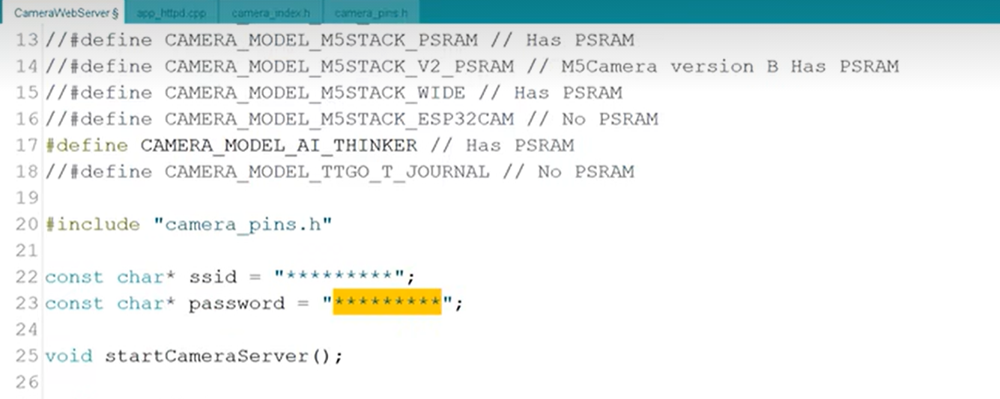


#### 3、烧录程序，网页控制

将文件保存至本地，把程序烧录到当前的摄像头端口中。把数据线拔掉后，重新连接，打开串口监视器，会出现一个网址，到浏览器中打开网址。

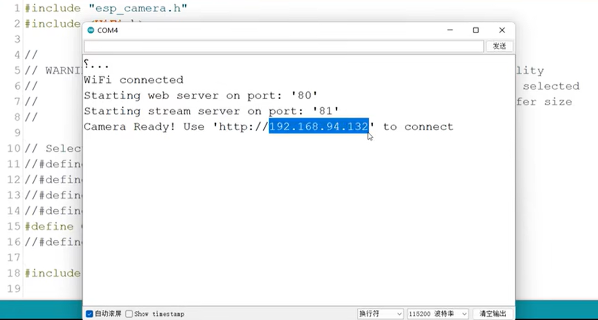

进来之后这就是摄像头的控制界面，下翻找到开始视频流，然后就可以看到当前的摄像头监控画面，左侧这里都是一些你可以去调整的参数，调整一下亮度，调整一下饱和度等等。
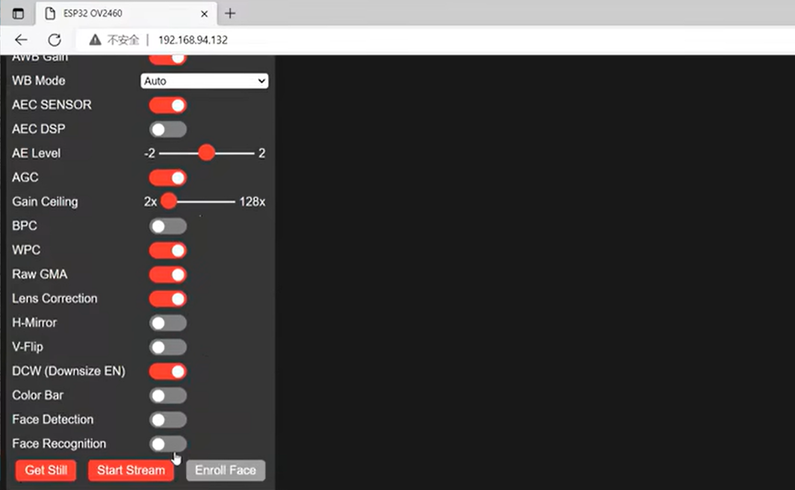


### 3、编写程序2（遥控小车）

#### 1、打开car_html_manager

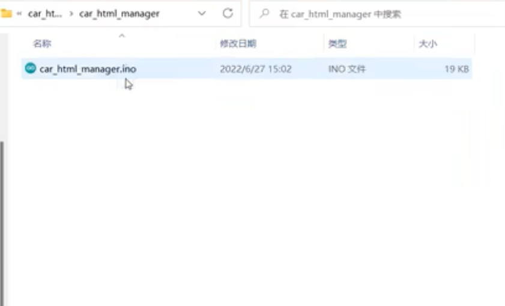

#### 2、更改网络

与上一个程序类似，需要修改ssid和password，不同的点在于这一个信号是由开发板发出的，我们需要设置这里的名称和密码，即对开发板发出的网络信号进行命名和设置。修改完成之后，将开发板连接到电脑，$\textcolor{red}{切换开发板适用的端口。}$

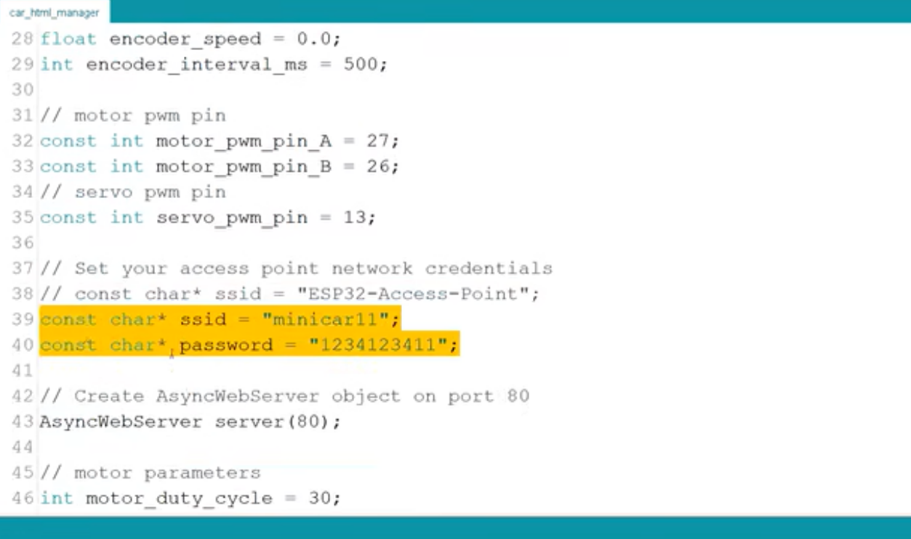

#### 3、烧录程序，网页控制

将程序烧录进开发板，开发板发出一个WiFi信号，它的名字就是刚刚我们命名的， 比如说我们命名为minicar11，然后用刚刚设置的密码连接这个网络。
重启一下开发板，然后打开串口监视器，会出现一个网址，到浏览器中打开网址。


进入网址后，我们会看到这样一个控制界面。因为我们已经连接开发板提供的网络信号，可以更换电池对开发板供电。然后把开发板和电池都放在小车上，这样我们就可以通过去控制网页上面的按钮，来遥控小车的行动。
比如说我们可以控制小车前进，停止，后退，左转，直行，右转等功能，我们还可以控制其前进的速度，拐弯的角度等，都可以自己来调整。

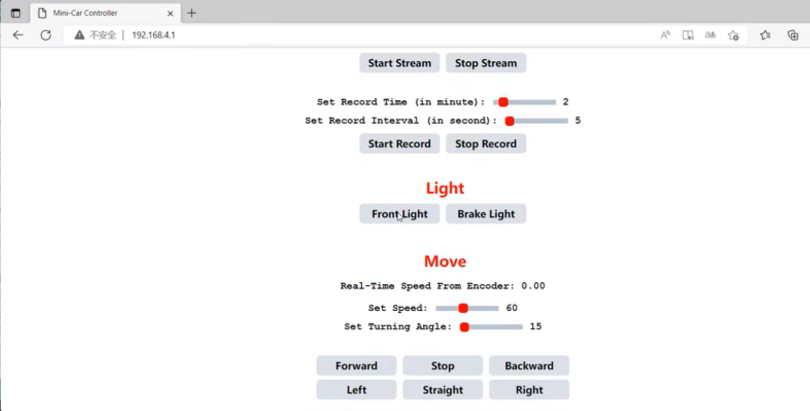


### 4、编写程序3（获取照片）

#### 1、打开IP_Camera_and_Record

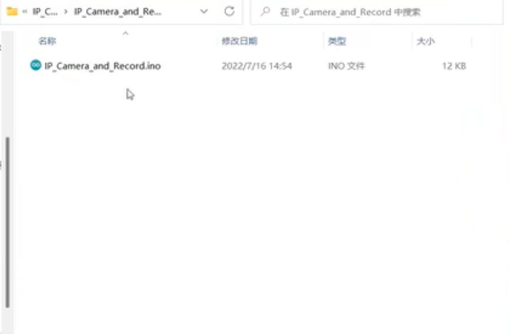

#### 2、更改网络

对于这个程序，同样的需要将ssid和password修改为上一个程序所设置的，即由开发板发出的网络信号。修改完成之后，将摄像头用数据线连接到电脑，$\textcolor{red}{同时切换摄像头适用的端口。}$

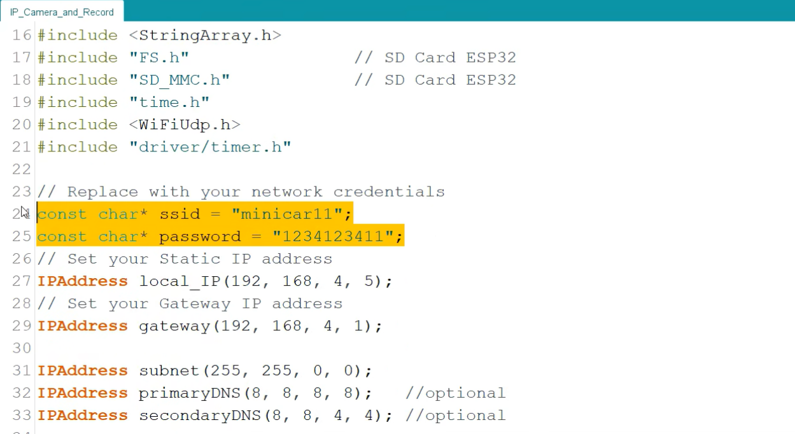

#### 3、烧录程序，网页控制

首先将SD卡从摄像头中取出；然后将网络重新连为手机上的热点，因为下载程序时，需要联网，而之前连接的开发板网络是不支持的；
接着，我们就把程序写入到摄像头中。

接着还是去打开串口监视器，先重启摄像头组件，然后将SD卡装入摄像头组件中，安装完成后，再次重启组件，会发现串口显示器出现了一个网址。

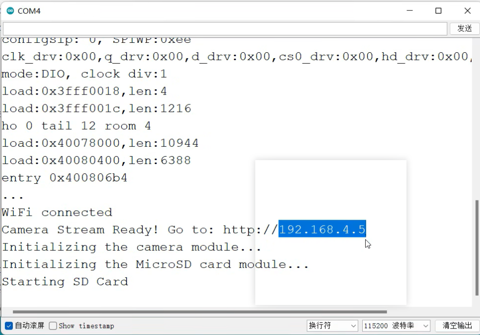

然后将网络切换回之前开发板发出的网络，到浏览器中打开网址。$\textcolor{red}{注意要在网址后加 /list }$

进入网址后，我们会看到这样一个控制界面，这是SD卡之前存储的一些照片。

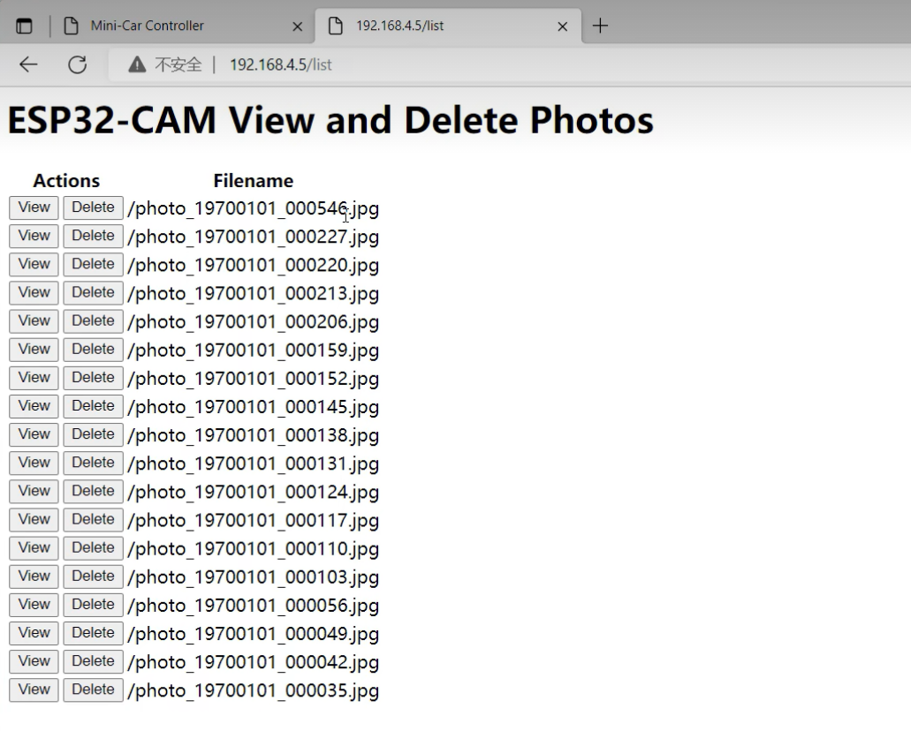
然后我们返回Mini--Car  Controller页面，现在开始视频流，就可以看到摄像头的实时画面，那么下面可以设置拍照执行的时间以及频率。比如说设置成一共要执行5分钟，每隔5秒钟拍摄一张图片，接着就可以开始录制。
点击开始录制按钮之后，可以返回到刚才的网站上刷新一下，就可以看到实时获取到的画面，左边就是查看，右边是删除。

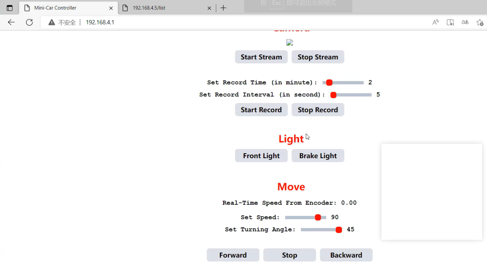

那么有了这两项功能之后，我们就可以将它应用到小车上，就实现了一个实时捕捉数据的过程。

首先我们使用小车去模拟它在路上行进，然后在这个过程中每隔5秒钟捕捉一张图片，那么最终就可以作为训练数据，为我们后续的一个自动驾驶模型的训练提供基础。

最终实现通过网站遥控小车，利用摄像头对地图进行拍照，采集相关数据。


同时，需要补充的是，我们可以利用键盘来控制小车的运动，主要原理就是为网页增加键盘监控。

 

## 三、相关代码

注：代码参考了引航计划相关内容

#### 1、程序2遥控小车的代码 car_html_manager

```C
path:./Part_Two/Camera_data_acquisition/car_html_manager.ino

```

#### 2、程序3获取照片的代码 IP_Camera_and_Record

```c
path:./Part_Two/Camera_data_acquisition/IP_Camera_and_Record.ino

```


参考：人工智能引航计划https://space.bilibili.com/1872807136


