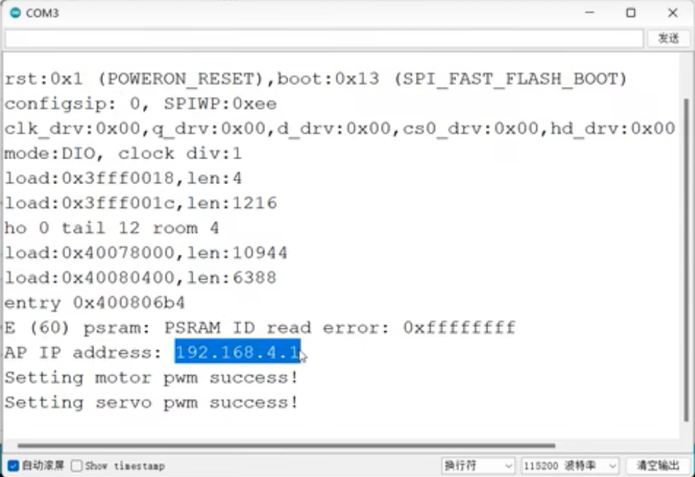

# automatic-mini-car with esp32-cam
# 智能小车


## 小车运动


### Arduino

#### 下载

##### 方法1：

Arduino 官网：[Software | Arduino](https://www.arduino.cc/en/software)

##### 方法2（推荐）：

> path:\work\SETTING\arduino-1.8.16-windows.exe

版本: arduino-1.8.16-windows


#### 配置ESP32开发环境

##### 方法1：

①文件>>首选项>>附加开发板管理器网址：https://dl.espressif.com/dl/package_esp32_index.json

②工具>>开发板>>开发板管理器>>esp32（选择版本进行安装）


##### 方法2（推荐）：

> path:\work\SETTING\arduino_conf

两个文件夹 ：AppData； Program Files (x86)

**AppData**

将`AppData\Local\Arduino15`中的文件覆盖到`C:\Users\ZXH\AppData\Local\Arduino15`中

`C:\Users\ZXH`可能无法查看到AppData文件夹。点击右上角查看勾选隐藏的项目即可

**Program Files (x86)**

将`Program Files (x86)\AppData`文件夹覆盖`C:\Program Files (x86)\AppData`文件夹

将`Program Files (x86)\Arduino`文件夹覆盖`C:\Program Files (x86)\Arduino`文件夹


### 运动

> path:\work\MOTION

#### 前进

##### 方法1：PWM控制电机

PWM

- frequency（频率）

 frequency = n

周期 T = $\frac{1}{n}$ 

eg: frequency = 50 Hz

​		T = 0.02s

- resolution（分辨率，占空比精度）

eg: resolution = 8 ($2^8$=256)

占空比取值0~255

- duty_cycle（占空比）

占空比 =  $\frac{高电平}{周期}$

所以通过控制**调整占空比**就能控制PWM信号从而能过**控制电机的转速**或者是**控制LED灯的亮度**，亦或是**控制舵机的旋转角度**


A，B 接收PWM信号

- channel（16个通道）

A:LOW 	 B:HIGH   A---->>>B

A:HIGH	  B:LOW   A<<<----B

A:HIGH 	 B:HIGH   A---------B

A:LOW  	 B:LOW   A<<<>>>B


```c++
// PWM控制电机
// path:\work\MOTION\PWM_FORWARD\PWM_FORWARD.ino
const int a = 26;
const int b = 27;
// pwm信号设置
// 频率 2000Hz
const int frequency = 2000;
// 分辨率（精确度） 8 2^8=256
const int resolution = 8;
// 16个信号通道 
const int channel_a = 0;
const int channel_b = 1;
// 占空比（7~32）
const int duty_cycle = 128;

void setup(){
  ledcSetup(channel_a,frequency,resolution);
  ledcAttachPin(a,channel_a);
  ledcSetup(channel_b,frequency,resolution);
  ledcAttachPin(b,channel_b);
}

void loop(){
  ledcWrite(channel_a,duty_cycle);
  ledcWrite(channel_b,0);
  delay(10000);
}
```


##### 方法2：MCPWM控制电机


```c++
// MCPWM控制电机
// path:\work\MOTION\MCPWM_FORWARD\MCPWM_FORWARD.ino
#include "driver/mcpwm.h"

void setup(){
  // motor
  // 用选定的MCPWM_UNIT_0来初始化gpio口
  mcpwm_gpio_init(MCPWM_UNIT_0,MCPWM0A,26);
  mcpwm_gpio_init(MCPWM_UNIT_0,MCPWM0B,27);
  // 通过mcpwm_config_t结构体为定时器设置频率和初始值
  mcpwm_config_t motor_pwm_config = {
    .frequency = 1000, // .frequency = 1000 -- motor_pwm_config.frequency = 1000
    .cmpr_a = 0,  // a 的占空比--%
    .cmpr_b = 0,  // b 的占空比--%
    .duty_mode = MCPWM_DUTY_MODE_0,   // 占空比模式（高电平）
    .counter_mode = MCPWM_UP_COUNTER, // 计数器模式（上位计数）
  };
  // 使用以上设置配置PWM0A和PWM0B
  mcpwm_init(MCPWM_UNIT_0, MCPWM_TIMER_0, &motor_pwm_config);
}

void loop(){
  // motor
  // 前进
  mcpwm_set_duty(MCPWM_UNIT_0, MCPWM_TIMER_0, MCPWM_OPR_A, 100);  // 设置占空比（mcpwm单元,定时器,操控A,占空比%）
  mcpwm_set_duty(MCPWM_UNIT_0, MCPWM_TIMER_0, MCPWM_OPR_B, 0);
}
```


#### 后退

##### 方法1：PWM控制电机

```c++
// PWM控制电机
// path:\work\MOTION\PWM_BACK\PWM_BACK.ino
const int a = 26;
const int b = 27;
// pwm信号设置
// 频率 2000Hz
const int frequency = 2000;
// 分辨率（精确度） 8 2^8=256
const int resolution = 8;
// 16个信号通道 
const int channel_a = 0;
const int channel_b = 1;
// 占空比（7~32）
const int duty_cycle = 128;

void setup(){
  ledcSetup(channel_a,frequency,resolution);
  ledcAttachPin(a,channel_a);
  ledcSetup(channel_b,frequency,resolution);
  ledcAttachPin(b,channel_b);
}

void loop(){
  ledcWrite(channel_b,duty_cycle);
  ledcWrite(channel_a,0);
  delay(10000);
}
```


##### 方法2：MCPWM控制电机

```c++
// MCPWM控制电机
// path:\work\MOTION\MCPWM_BACK\MCPWM_BACK.ino
#include "driver/mcpwm.h"

void setup(){
  // motor
  // 用选定的MCPWM_UNIT_0来初始化gpio口
  mcpwm_gpio_init(MCPWM_UNIT_0,MCPWM0A,26);
  mcpwm_gpio_init(MCPWM_UNIT_0,MCPWM0B,27);
  // 通过mcpwm_config_t结构体为定时器设置频率和初始值
  mcpwm_config_t motor_pwm_config = {
    .frequency = 1000, // .frequency = 1000 -- motor_pwm_config.frequency = 1000
    .cmpr_a = 0,  // a 的占空比--%
    .cmpr_b = 0,  // a 的占空比--%
    .duty_mode = MCPWM_DUTY_MODE_0,   // 占空比模式（高电平）
    .counter_mode = MCPWM_UP_COUNTER, // 计数器模式（上位计数）
  };
  // 使用以上设置配置PWM0A和PWM0B
  mcpwm_init(MCPWM_UNIT_0, MCPWM_TIMER_0, &motor_pwm_config);
}

void loop(){
  // motor
  // 后退
  mcpwm_set_duty(MCPWM_UNIT_0, MCPWM_TIMER_0, MCPWM_OPR_A, 0);  // 设置占空比（mcpwm单元,定时器,操控A,占空比%）
  mcpwm_set_duty(MCPWM_UNIT_0, MCPWM_TIMER_0, MCPWM_OPR_B, 100);
}
```


#### 左转/右转/直行

##### PWM/MCPWM控制舵机


- PWM

channel = 0

frequency = 50 (T=0.02s=20ms)

resolution = 8


0.5ms--->>>0°			1ms--->>>45°		1.5ms--->>>90°

2ms--->>>135°			2.5ms--->>>180°

占空比

0°

$\frac{0.5}{20}$ = 2.5%


256*2.5% = 6.4 $\approx$ 7

90°

$\frac{1.5}{20}$ = 7.5%

256* 7.5% = 19.2 $\approx$ 20

180°

$\frac{2.5}{20}$ = 12.5%

256*12.5% = 32


- MCPWM

0°: $\frac{0.5}{20}$ = 2.5%

90°: $\frac{1.5}{20}$ = 7.5%

180°: $\frac{2.5}{20}$ = 12.5%


##### MCPWM控制电机

```c++
// MCPWM控制电机
// path:\work\MOTION\MCPWM_DIRECTION\MCPWM_DIRECTION.ino
#include "driver/mcpwm.h"

void setup(){
  // servo
  Serial.begin(115200);
  // 用选定的MCPWM_UNIT_1来初始化gpio口
  mcpwm_gpio_init(MCPWM_UNIT_1,MCPWM1A,13);
  // 通过mcpwm_config_t结构体为定时器设置频率和初始值
  mcpwm_config_t servo_pwm_config;
  servo_pwm_config.frequency = 50;
  servo_pwm_config.cmpr_a = 0; // a 的占空比--%
  servo_pwm_config.duty_mode = MCPWM_DUTY_MODE_0;   // 占空比模式（高电平）
  servo_pwm_config.counter_mode = MCPWM_UP_COUNTER; // 计数器模式（上位计数）
  // 使用以上设置配置PWM1A
  mcpwm_init(MCPWM_UNIT_1, MCPWM_TIMER_1, &servo_pwm_config);
}

void loop(){
  Serial.println("Setting servo pwm success!");
  // servo
  // mcpwm_stop(MCPWM_UNIT_1, MCPWM_TIMER_1);
  // 直行
  mcpwm_set_duty(MCPWM_UNIT_1, MCPWM_TIMER_1, MCPWM_OPR_A, 7.5);  // 设置占空比（mcpwm单元,定时器,操控A,占空比% （2.5%~12.5%））90度
  delay(2000);
  // 左转
  mcpwm_set_duty(MCPWM_UNIT_1, MCPWM_TIMER_1, MCPWM_OPR_A, 2.5); // 0度 2.5%
  delay(2000);
  // 直行
  mcpwm_set_duty(MCPWM_UNIT_1, MCPWM_TIMER_1, MCPWM_OPR_A, 7.5); // 90度 7.5%
  delay(2000);
  // 右转
  mcpwm_set_duty(MCPWM_UNIT_1, MCPWM_TIMER_1, MCPWM_OPR_A, 12.5); // 180度 12.5%
  delay(2000);
}
```


#### 整合

```c++
// path:\work\CAR_FUNCTION\CAR_FUNCTION.ino
```


# 智能小车采集数据


## 一、工作目的

实现通过网站遥控小车，并利用摄像头对地图进行拍照，采集相关数据。

## 二、具体步骤

### 1、安装摄像头

摄像头上有一个USB接口，将摄像头连接，在插入数据线的同时，将SD卡取出。

$\textcolor{red}{因为芯片在执行程序的时候，可能会同时去读取SD卡，从而造成芯片处于一个繁忙的状态，后续我们烧取程序时可能会报错。}$

$\textcolor{red}{切记要修改为摄像头对应的端口}$

### 2、编写程序1（手机热点）

#### 1、打开示例


#### 2、修改示例

##### 1、修改AI__THINKER模块


##### 2、将ssid,password修改为相应的配置

比如更改为手机热点的名称，和密码


#### 3、烧录程序，网页控制

将文件保存至本地，把程序烧录到当前的摄像头端口中。把数据线拔掉后，重新连接，打开串口监视器，会出现一个网址，到浏览器中打开网址。


进来之后这就是摄像头的控制界面，下翻找到开始视频流，然后就可以看到当前的摄像头监控画面，左侧这里都是一些你可以去调整的参数，调整一下亮度，调整一下饱和度等等。


### 3、编写程序2（遥控小车）

#### 1、打开car_html_manager


#### 2、更改网络

与上一个程序类似，需要修改ssid和password，不同的点在于这一个信号是由开发板发出的，我们需要设置这里的名称和密码，即对开发板发出的网络信号进行命名和设置。修改完成之后，将开发板连接到电脑，$\textcolor{red}{切换开发板适用的端口。}$


#### 3、烧录程序，网页控制

将程序烧录进开发板，开发板发出一个WiFi信号，它的名字就是刚刚我们命名的， 比如说我们命名为minicar11，然后用刚刚设置的密码连接这个网络。
重启一下开发板，然后打开串口监视器，会出现一个网址，到浏览器中打开网址。




进入网址后，我们会看到这样一个控制界面。因为我们已经连接开发板提供的网络信号，可以更换电池对开发板供电。然后把开发板和电池都放在小车上，这样我们就可以通过去控制网页上面的按钮，来遥控小车的行动。
比如说我们可以控制小车前进，停止，后退，左转，直行，右转等功能，我们还可以控制其前进的速度，拐弯的角度等，都可以自己来调整。


### 4、编写程序3（获取照片）

#### 1、打开IP_Camera_and_Record


#### 2、更改网络

对于这个程序，同样的需要将ssid和password修改为上一个程序所设置的，即由开发板发出的网络信号。修改完成之后，将摄像头用数据线连接到电脑，$\textcolor{red}{同时切换摄像头适用的端口。}$


#### 3、烧录程序，网页控制

首先将SD卡从摄像头中取出；然后将网络重新连为手机上的热点，因为下载程序时，需要联网，而之前连接的开发板网络是不支持的；
接着，我们就把程序写入到摄像头中。

接着还是去打开串口监视器，先重启摄像头组件，然后将SD卡装入摄像头组件中，安装完成后，再次重启组件，会发现串口显示器出现了一个网址。


然后将网络切换回之前开发板发出的网络，到浏览器中打开网址。$\textcolor{red}{注意要在网址后加 /list }$

进入网址后，我们会看到这样一个控制界面，这是SD卡之前存储的一些照片。


然后我们返回Mini--Car  Controller页面，现在开始视频流，就可以看到摄像头的实时画面，那么下面可以设置拍照执行的时间以及频率。比如说设置成一共要执行5分钟，每隔5秒钟拍摄一张图片，接着就可以开始录制。
点击开始录制按钮之后，可以返回到刚才的网站上刷新一下，就可以看到实时获取到的画面，左边就是查看，右边是删除。


那么有了这两项功能之后，我们就可以将它应用到小车上，就实现了一个实时捕捉数据的过程。

首先我们使用小车去模拟它在路上行进，然后在这个过程中每隔5秒钟捕捉一张图片，那么最终就可以作为训练数据，为我们后续的一个自动驾驶模型的训练提供基础。

最终实现通过网站遥控小车，利用摄像头对地图进行拍照，采集相关数据。


同时，需要补充的是，我们可以利用键盘来控制小车的运动，主要原理就是为网页增加键盘监控。

 

## 三、相关代码

注：代码参考了引航计划相关内容

#### 1、程序2遥控小车的代码 car_html_manager

```C
/*********
  https://randomnerdtutorials.com/esp32-esp8266-input-data-html-form/
*********/

#include "WiFi.h"
#include "esp_timer.h"
#include "Arduino.h"
#include "soc/soc.h"           // Disable brownout problems
#include "soc/rtc_cntl_reg.h"  // Disable brownout problems
#include "driver/rtc_io.h"
#include "driver/mcpwm.h"
#include <ESPAsyncWebServer.h>
#include <StringArray.h>
#include <FS.h>

esp_err_t esp_err;

// LED pin
const int front_led_pin = 32;
const int back_led_pin = 33;
const int left_turn_led_pin = 21;
const int right_turn_led_pin = 22;
const int brake_led_pin = 23;

// encoder pin
const int encoder_pin = 2;
int count = 0;
float encoder_speed = 0.0;
int encoder_interval_ms = 500;

// motor pwm pin
const int motor_pwm_pin_A = 27;
const int motor_pwm_pin_B = 26;
// servo pwm pin
const int servo_pwm_pin = 13;

// Set your access point network credentials
// const char* ssid = "ESP32-Access-Point";
const char* ssid = "MINICAR-xzw";
const char* password = "123456789";

// Create AsyncWebServer object on port 80
AsyncWebServer server(80);

// motor parameters
int motor_duty_cycle = 30;
int servo_turn_angle = 45;
float servo_duty_cycle_center = 7.5;
float servo_duty_cycle_differ = 5;

void toggle_light(int color);
void control_all_light(bool);
void move_forward();
void move_backward();
void motor_stop();
void turn_left();
void turn_right();
void straight();

void IRAM_ATTR count_add() {
  count += 1;
}

const char index_html[] PROGMEM = R"rawliteral(
<!DOCTYPE HTML>
<html>
<head>
  <title>Mini-Car Controller</title>
  <meta name="viewport" content="width=device-width, initial-scale=1">
<style>
  { font-family: sans-serif; background: #eee; padding: 1rem; }
  body { max-width: 1200px; margin: 0 auto; background: white; }
  nav {
    background: rgb(50, 70, 99); 
    display: flex; 
    align-items: center; 
    padding: 0 0.5rem; 
    min-height: 4em;
  }
  nav h1 { 
      flex: auto; margin: 0; 
      color: #ffffff; 
      font: 1em lucida-grande;
      font-size: 32px;
      font-weight: 1000;
      margin-left: 0.3em;
  }
  .content { padding: 0 1rem 1rem; }
  .content > header { 
      /* border-bottom: 2px solid rgba(115, 133, 159, 0.5); */
      display: flex; align-items: flex-end; 
      /* background-color: #9fb2bb; */
  }
  .content > header h1 { 
      font: 1em lucida-grande;
      font-size: 24px;
      font-weight: 1000;
      color: #ff0000;
      flex: auto; 
      margin: 1rem 0 0.3rem 0; 
      margin-left: 0.3em;
  }
  .content p {
      margin: 5px;
      font-family: 'Courier New', Courier, monospace;
      font-size: 16px;
      font-weight: bold;
      line-height: 30px;
  }
  .content input[type=button] { 
      align-self: start; min-width: 8em; min-height: 2em; 
      font: 1em lucida-grande;
      font-size: 16px;
      font-weight: 1000;
      border: 0px;
      border-radius: 0.4em;
      background: rgba(115, 133, 159, 0.25);
  }
  .content input[type=button]:active {
      background: rgba(115, 133, 159, 0.507);
  }
</style>
</head>
<body>
  <nav>
    <h1 align="center">Mini car controller</h1>
  </nav>
  <section class="content">
    <header>
      <h1 align="center">Camera</h1>
    </header>
    <p align="center">
      
      <br>
      <input type="button" id="start_stream" name="Start Stream" value="Start Stream">
      <input type="button" id="stop_stream" name="Stop Stream" value="Stop Stream">
    </p>
    <script>
      var isStreaming = true;
      var isRecording = false;
      document.getElementById('start_stream').onclick = function() {
        isStreaming = true;
      }
      document.getElementById('stop_stream').onclick = function() {
        isStreaming = false;
      }
      function refresh_img() {
        if (isStreaming && (!isRecording)) {
          document.getElementById("photo").src = "http://192.168.4.5/capture"
                                                 + '?_=' + (new Date()).getTime();
        }
      }
      setInterval(refresh_img, 2000);
    </script>
    <br>
    <p align="center">
      Set Record Time (in minute):
      <input class="slider" type="range" min="1" max="10" value="2" step="1" id="record_time">
      <span id="record_time_span"></span>
      <br>
      Set Record Interval (in second):
      <input class="slider" type="range" min="5" max="20" value="5" step="1" id="record_interval">
      <span id="record_interval_span"></span>
      <style>
        input[type=range] {
            /*滑动条背景*/
            -webkit-appearance: none;
            background-color: rgba(115, 133, 159, 0.5);
            height: 8px;
            width: 100px;
        }
        input[type=range]::-webkit-slider-thumb {
            /*滑动条操作按钮样式*/
            -webkit-appearance: none;
            border-radius: 5px;
            background: rgb(255, 0, 0);
            width: 15px;
            height: 15px;
        }
      </style>
      <script>
        document.getElementById('record_time_span').innerHTML = 2;
        document.getElementById('record_interval_span').innerHTML = 5;
        var record_time = document.getElementById('record_time');
        var record_interval = document.getElementById('record_interval');
        var current;
        record_time.oninput = function() {
          current = this.value;
          document.getElementById('record_time_span').innerHTML = current;
        }
        record_interval.oninput = function() {
          current = this.value;
          document.getElementById('record_interval_span').innerHTML = current;
        }
      </script>
    </p>

    <p align="center">
      <input type="button" name="Start Record" value="Start Record" id="start_record">
      <input type="button" name="Stop Record" value="Stop Record" id="stop_record">
      <script>
        // XMLHttpRequest 在不刷新页面的情况下请求特定 URL，获取数据
        var xhttp = new XMLHttpRequest();
        document.getElementById('start_record').onclick = function() {
          xhttp.open("GET", "http://192.168.4.5/record?record_time="
                            + document.getElementById('record_time_span').innerHTML.toString() 
                            + "&record_interval=" 
                            + document.getElementById('record_interval_span').innerHTML.toString() 
          );
          xhttp.send();
          isRecording = true;
          function set_isRecording_false() {
            isRecording = false;
            console.log("Stop record. You can get ip camera stream now.");
          }
          setTimeout(set_isRecording_false, document.getElementById('record_time_span').innerHTML * 60 * 1000);
          console.log("Start record... Can't get ip camera stream now.");
        }
        document.getElementById('stop_record').onclick = function() {
          isRecording = false;
          xhttp.open("GET", "http://192.168.4.5/stop_record");
          xhttp.send();
          console.log("Stop record. You can get ip camera stream now.");
        }
      </script>
    </p>
  </section>
  
  <section class="content">
    <header>
        <h1 align="center">Light</h1>
    </header>
    <p align="center">
      <input type="button" name="Front Light" value="Front Light" id="front_light">
      <input type="button" name="Brake Light" value="Brake Light" id="brake_light">
    </p>
    <script>
      var xhttp = new XMLHttpRequest();
      document.getElementById('front_light').onclick = function() {
        xhttp.open("POST", "/front_light");
        xhttp.send();
        console.log('toggle front light');
      }
      document.getElementById('brake_light').onclick = function() {
        xhttp.open("POST", "/back_light");
        xhttp.send();
        console.log('toggle back light');
      }
    </script>
    <br>
    
    <header>
        <h1 align="center">Move</h1>
    </header>
    <p align="center">
      Real-Time Speed From Encoder: <span id="encoder_span">0.0</span>
    </p>
    <script>
      var xhttp_recorder = new XMLHttpRequest();
      xhttp_recorder.onreadystatechange = function() {
        if (xhttp_recorder.status === 200) {
          document.getElementById('encoder_span').innerHTML = this.responseText;
        }
      }
      function refresh_speed() {
        xhttp_recorder.open("GET", "/get_encoder");
        xhttp_recorder.send();
      }
      setInterval(refresh_speed, 200);
    </script>
    
    <p align="center">
      Set Speed:
      <input class="slider" type="range" min="30" max="100" value="60" step="10" id="speed">
      <span id="speed_span"></span>
      <br>
      Set Turning Angle:
      <input class="slider" type="range" min="15" max="45" value="15" step="30" id="angle">
      <span id="angle_span"></span>
      <style>
        input[type=range] {
            /*滑动条背景*/
            -webkit-appearance: none;
            background-color: rgba(115, 133, 159, 0.5);
            height: 8px;
            width: 100px;
        }
        input[type=range]::-webkit-slider-thumb {
            /*滑动条操作按钮样式*/
            -webkit-appearance: none;
            border-radius: 5px;
            background: rgb(255, 0, 0);
            width: 15px;
            height: 15px;
        }
      </style>
      <script>
        var xhttp = new XMLHttpRequest();
        document.getElementById('speed_span').innerHTML = 60;
        document.getElementById('angle_span').innerHTML = 15;
        var motor_speed = document.getElementById('speed');
        var servo_angle = document.getElementById('angle');
        var current;
        motor_speed.oninput = function() {
          current = this.value;
          document.getElementById('speed_span').innerHTML = current;
        }
        servo_angle.oninput = function() {
          current = this.value;
          document.getElementById('angle_span').innerHTML = current;
        }
        motor_speed.onchange = function() {
          current = this.value;
          xhttp.open("POST", "/change_speed?speed=" + current.toString());
          xhttp.send();
          console.log('change speed');
        }
        servo_angle.onchange = function() {
          current = this.value;
          xhttp.open("POST", "/change_turn_angle?angle=" + current.toString());
          xhttp.send();
          console.log('change turn angle');
        }
      </script>
    </p>
    <br>
    
    <p align="center">
      <input type="button" name="Forward" value="Forward" id="forward">
      <input type="button" name="Stop" value="Stop" id="stop">
      <input type="button" name="Backward" value="Backward" id="backward">
    </p>
    <p align="center">
      <input type="button" name="Left" value="Left" id="left">
      <input type="button" name="Straight" value="Straight" id="straight">
      <input type="button" name="Right" value="Right" id="right">
    </p>
    <script>
      // XMLHttpRequest 在不刷新页面的情况下请求特定 URL，获取数据
      var xhttp = new XMLHttpRequest();
      // button elements
      var forward_button = document.getElementById('forward');
      var backward_button = document.getElementById('backward');
      var stop_button = document.getElementById('stop');
      var left_button = document.getElementById('left');
      var right_button = document.getElementById('right');
      var straight_button = document.getElementById('straight');
      
      forward_button.onclick = function() {
        xhttp.open("POST", "/forward");
        xhttp.send();
        console.log('move forward');
      }
      backward_button.onclick = function() {
        xhttp.open("POST", "/backward");
        xhttp.send();
        console.log('move backward');
      }
      stop_button.onclick = function() {
        xhttp.open("POST", "/stop");
        xhttp.send();
        console.log('stop');
      }
      left_button.onclick = function() {
        xhttp.open("POST", "/left");
        xhttp.send();
        console.log('left');
      }
      right_button.onclick = function() {
        xhttp.open("POST", "/right");
        xhttp.send();
        console.log('right');
      }
      straight_button.onclick = function() {
        xhttp.open("POST", "/straight");
        xhttp.send();
        console.log('straight');
      }
    </script>
  </section>
</body>
</html>)rawliteral";

void setup() {
  // Serial port for debugging purposes
  Serial.begin(115200);

  WiFi.mode(WIFI_AP);
  if(!WiFi.softAPConfig(IPAddress(192, 168, 4, 1), IPAddress(192, 168, 4, 1), IPAddress(255, 255, 0, 0))){
      Serial.println("AP Config Failed");
  }
  WiFi.softAP(ssid, password, 1, 0, 10);

  IPAddress IP = WiFi.softAPIP();
  Serial.print("AP IP address: ");
  Serial.println(IP);

  // Turn-off the 'brownout detector'
  WRITE_PERI_REG(RTC_CNTL_BROWN_OUT_REG, 0);

  // set led pinmode
  pinMode(front_led_pin, OUTPUT);
  pinMode(back_led_pin, OUTPUT);
  pinMode(left_turn_led_pin, OUTPUT);
  pinMode(right_turn_led_pin, OUTPUT);
  pinMode(brake_led_pin, OUTPUT);

  // set encoder interrupt
  pinMode(encoder_pin, INPUT);
  attachInterrupt(encoder_pin, count_add, RISING);

  // motor pwm config
  mcpwm_gpio_init(MCPWM_UNIT_0, MCPWM0A, motor_pwm_pin_A);
  mcpwm_gpio_init(MCPWM_UNIT_0, MCPWM0B, motor_pwm_pin_B);
  mcpwm_config_t motor_pwm_config = {
    .frequency = 1000,
    .cmpr_a = 0,
    .cmpr_b = 0,
    .duty_mode = MCPWM_DUTY_MODE_0,
    .counter_mode = MCPWM_UP_COUNTER,
  };
  esp_err = mcpwm_init(MCPWM_UNIT_0, MCPWM_TIMER_0, &motor_pwm_config);
  if (esp_err == 0)
    Serial.println("Setting motor pwm success!");
  else {
    Serial.print("Setting motor pwm fail, error code: ");
    Serial.println(esp_err);
  }

  // servo pwm config
  mcpwm_gpio_init(MCPWM_UNIT_1, MCPWM1A, servo_pwm_pin);
  mcpwm_config_t servo_pwm_config;
  servo_pwm_config.frequency = 50;
  servo_pwm_config.cmpr_a = 0;
  servo_pwm_config.duty_mode = MCPWM_DUTY_MODE_0;
  servo_pwm_config.counter_mode = MCPWM_UP_COUNTER;
  esp_err = mcpwm_init(MCPWM_UNIT_1, MCPWM_TIMER_1, &servo_pwm_config);
  if (esp_err == 0)
    Serial.println("Setting servo pwm success!");
  else {
    Serial.print("Setting servo pwm fail, error code: ");
    Serial.println(esp_err);
  }
  mcpwm_start(MCPWM_UNIT_1, MCPWM_TIMER_1);

  // Route for web page
  server.on("/", HTTP_GET, [](AsyncWebServerRequest * request) {
    request->send_P(200, "text/html", index_html);
  });
  
  server.on("/front_light", HTTP_POST, [](AsyncWebServerRequest * request) {
    toggle_light(1);
    request->send(200);
  });
  server.on("/back_light", HTTP_POST, [](AsyncWebServerRequest * request) {
    toggle_light(2);
    request->send(200);
  });
  server.on("/get_encoder", HTTP_GET, [](AsyncWebServerRequest * request) {
    request->send(200, "text/plain", String(encoder_speed));
//    request->send_P(200, "text/plain", "123");
  });
  server.on("/change_speed", HTTP_POST, [](AsyncWebServerRequest * request) {
    motor_duty_cycle = request->getParam("speed")->value().toInt();
    request->send(200);
  });
  server.on("/change_turn_angle", HTTP_POST, [](AsyncWebServerRequest * request) {
    servo_turn_angle = request->getParam("angle")->value().toInt();
    if (servo_turn_angle == 45) servo_duty_cycle_differ = 5;
    else servo_duty_cycle_differ = 1.5;
    request->send(200);
  });
  server.on("/forward", HTTP_POST, [](AsyncWebServerRequest * request) {
//    digitalWrite(back_led_pin, LOW);
    move_forward();
    request->send(200);
  });
  server.on("/backward", HTTP_POST, [](AsyncWebServerRequest * request) {
//    digitalWrite(back_led_pin, HIGH);
    move_backward();
    request->send(200);
  });
  server.on("/stop", HTTP_POST, [](AsyncWebServerRequest * request) {
//    digitalWrite(back_led_pin, LOW);
    motor_stop();
    request->send(200);
  });
  server.on("/left", HTTP_POST, [](AsyncWebServerRequest * request) {
//    digitalWrite(left_turn_led_pin, LOW);
//    digitalWrite(right_turn_led_pin, HIGH);
    turn_left();
    request->send(200);
  });
  server.on("/right", HTTP_POST, [](AsyncWebServerRequest * request) {
//    digitalWrite(left_turn_led_pin, HIGH);
//    digitalWrite(right_turn_led_pin, LOW);
    turn_right();
    request->send(200);
  });
  server.on("/straight", HTTP_POST, [](AsyncWebServerRequest * request) {
//    digitalWrite(left_turn_led_pin, HIGH);
//    digitalWrite(right_turn_led_pin, HIGH);
    straight();
    request->send(200);
  });
  // Start server
  server.begin();

  control_all_light(true);
  delay(500);
  control_all_light(false);
  delay(500);
  control_all_light(true);
  delay(500);
  control_all_light(false);
}

void loop() {
  count = 0;
  delay(encoder_interval_ms);
  encoder_speed = count / 18.0 / 21 * 6.2 * 3.14 * 1000 / encoder_interval_ms;
//  Serial.print("Speed: ");
//  Serial.println(encoder_speed);
}

/*
const int front_led_pin = 21;
const int back_led_pin = 22;
const int left_turn_led_pin = 32;
const int right_turn_led_pin = 33;
const int brake_led_pin = 23;
*/

// some functions
void toggle_light(int color) {
  if (color == 1) {
    bool state = digitalRead(front_led_pin);
    digitalWrite(front_led_pin, !state);
  }
  else if (color == 2) {
    bool state = digitalRead(back_led_pin);
    digitalWrite(back_led_pin, !state);
  }
}
void control_all_light(bool flag) {
  digitalWrite(front_led_pin, !flag);
  digitalWrite(back_led_pin, !flag);
  digitalWrite(left_turn_led_pin, flag);
  digitalWrite(right_turn_led_pin, flag);
  digitalWrite(brake_led_pin, flag);
}

void move_forward() {
  Serial.println("--- move forward...");
  mcpwm_stop(MCPWM_UNIT_0, MCPWM_TIMER_0);
  mcpwm_set_duty(MCPWM_UNIT_0, MCPWM_TIMER_0, MCPWM_OPR_A, 0);
  mcpwm_set_duty(MCPWM_UNIT_0, MCPWM_TIMER_0, MCPWM_OPR_B, motor_duty_cycle);
  mcpwm_start(MCPWM_UNIT_0, MCPWM_TIMER_0);
}
void move_backward() {
  mcpwm_stop(MCPWM_UNIT_0, MCPWM_TIMER_0);
  mcpwm_set_duty(MCPWM_UNIT_0, MCPWM_TIMER_0, MCPWM_OPR_A, motor_duty_cycle);
  mcpwm_set_duty(MCPWM_UNIT_0, MCPWM_TIMER_0, MCPWM_OPR_B, 0);
  mcpwm_start(MCPWM_UNIT_0, MCPWM_TIMER_0);
  Serial.println("--- move backward...");
}
void motor_stop() {
  Serial.println("--- motor stop...");
  mcpwm_stop(MCPWM_UNIT_0, MCPWM_TIMER_0);
  mcpwm_set_duty(MCPWM_UNIT_0, MCPWM_TIMER_0, MCPWM_OPR_A, 100);
  mcpwm_set_duty(MCPWM_UNIT_0, MCPWM_TIMER_0, MCPWM_OPR_B, 100);
  mcpwm_start(MCPWM_UNIT_0, MCPWM_TIMER_0);
}
void turn_left() {
  mcpwm_set_duty(MCPWM_UNIT_1, MCPWM_TIMER_1, MCPWM_OPR_A, servo_duty_cycle_center - servo_duty_cycle_differ);
}
void turn_right() {
  mcpwm_set_duty(MCPWM_UNIT_1, MCPWM_TIMER_1, MCPWM_OPR_A, servo_duty_cycle_center + servo_duty_cycle_differ);
}
void straight() {
  mcpwm_set_duty(MCPWM_UNIT_1, MCPWM_TIMER_1, MCPWM_OPR_A, servo_duty_cycle_center);
}
```

#### 2、程序3获取照片的代码 IP_Camera_and_Record

```c
/*********
  https://techtutorialsx.com/2017/10/07/esp32-arduino-timer-interrupts/
  https://github.com/espressif/arduino-esp32/issues/1313
  https://github.com/espressif/arduino-esp32/blob/master/cores/esp32/esp32-hal-timer.c
*********/

#include "WiFi.h"
#include "esp_camera.h"
#include "esp_timer.h"
#include "img_converters.h"
#include "Arduino.h"
#include "soc/soc.h"           // Disable brownout problems
#include "soc/rtc_cntl_reg.h"  // Disable brownout problems
#include "driver/rtc_io.h"
#include <ESPAsyncWebServer.h>
#include <StringArray.h>
#include "FS.h"                // SD Card ESP32
#include "SD_MMC.h"            // SD Card ESP32
#include "time.h"
#include <WiFiUdp.h>
#include "driver/timer.h"

// Replace with your network credentials
const char* ssid = "turcar";
const char* password = "123456789";
// Set your Static IP address
IPAddress local_IP(192, 168, 4, 5);
// Set your Gateway IP address
IPAddress gateway(192, 168, 4, 1);

IPAddress subnet(255, 255, 0, 0);
IPAddress primaryDNS(8, 8, 8, 8);   //optional
IPAddress secondaryDNS(8, 8, 4, 4); //optional

// Create AsyncWebServer object on port 80
AsyncWebServer server(80);

boolean takeNewPhoto = false;
String lastPhoto = "";
String list = "";
hw_timer_t * timer = NULL;
hw_timer_t * timer_1 = NULL;
boolean isRecording = false;

// HTTP GET parameter
const char* PARAM_INPUT_1 = "photo";
const char* PARAM_INPUT_2 = "record_time";
const char* PARAM_INPUT_3 = "record_interval";

// OV2640 camera module pins (CAMERA_MODEL_AI_THINKER)
#define PWDN_GPIO_NUM     32
#define RESET_GPIO_NUM    -1
#define XCLK_GPIO_NUM      0
#define SIOD_GPIO_NUM     26
#define SIOC_GPIO_NUM     27

#define Y9_GPIO_NUM       35
#define Y8_GPIO_NUM       34
#define Y7_GPIO_NUM       39
#define Y6_GPIO_NUM       36
#define Y5_GPIO_NUM       21
#define Y4_GPIO_NUM       19
#define Y3_GPIO_NUM       18
#define Y2_GPIO_NUM        5
#define VSYNC_GPIO_NUM    25
#define HREF_GPIO_NUM     23
#define PCLK_GPIO_NUM     22

// Stores the camera configuration parameters
camera_config_t config;

File root;

void setup() {
  // Turn-off the brownout detector
  WRITE_PERI_REG(RTC_CNTL_BROWN_OUT_REG, 0);
  
  // Serial port for debugging purposes
  Serial.begin(115200);

  // Configures static IP address
  if (!WiFi.config(local_IP, gateway, subnet, primaryDNS, secondaryDNS)) {
    Serial.println("STA Failed to configure");
  }
  // Wi-Fi connection
  WiFi.begin(ssid, password);
  while (WiFi.status() != WL_CONNECTED) {
    delay(1000);
    Serial.print(".");
  }
  Serial.println("");
  Serial.println("WiFi connected");
  Serial.print("Camera Stream Ready! Go to: http://");
  Serial.println(WiFi.localIP());
  
  Serial.println("Initializing the camera module...");
  configInitCamera();
  
  Serial.println("Initializing the MicroSD card module... ");
  initMicroSDCard();
  
  server.on("/capture", HTTP_GET, [](AsyncWebServerRequest * request) {
    if (takeNewPhoto) {
      request->send_P(200, "text/plain", "");
    } else {
      camera_fb_t * frame = esp_camera_fb_get();
      request->send_P(200, "image/jpeg", (const uint8_t *)frame->buf, frame->len);
      esp_camera_fb_return(frame);
      frame = NULL;
    }
  });
  
  server.on("/list", HTTP_GET, [](AsyncWebServerRequest * request) {
    request->send_P(200, "text/html", list.c_str());
  });
  
  server.on("/view", HTTP_GET, [](AsyncWebServerRequest * request) {
    String inputMessage;
    String inputParam;
    // GET input1 value on <ESP_IP>/view?photo=<inputMessage>
    if (request->hasParam(PARAM_INPUT_1)) {
      inputMessage = "/" + request->getParam(PARAM_INPUT_1)->value();
      Serial.print("Trying to open ");
      Serial.println(inputMessage);
      inputParam = PARAM_INPUT_1;
    }
    else {
      inputMessage = "No message sent";
      inputParam = "none";
    }
    Serial.println(inputMessage);
    request->send(SD_MMC, inputMessage, "image/jpg", false);
  });
  
  // Send a GET request to <ESP_IP>/delete?photo=<inputMessage>
  server.on("/delete", HTTP_GET, [] (AsyncWebServerRequest *request) {
    String inputMessage;
    String inputParam;
    // GET input1 value on <ESP_IP>/delete?photo=<inputMessage>
    if (request->hasParam(PARAM_INPUT_1)) {
      inputMessage = "/" + request->getParam(PARAM_INPUT_1)->value();
      inputParam = PARAM_INPUT_1;
    }
    else {
      inputMessage = "No message sent";
      inputParam = "none";
    }
    Serial.println(inputMessage);
    deleteFile(SD_MMC, inputMessage.c_str());
    request->send(200, "text/html", "Done. Your photo named " + inputMessage + " was removed." +
                                     "<br><a href=\"/list\">view/delete other photos</a>.");
  });

  server.on("/record", HTTP_GET, [](AsyncWebServerRequest * request) {
    String inputMessage_2;
    String inputMessage_3;
    // GET input1 value on <ESP_IP>/view?photo=<inputMessage>
    if (request->hasParam(PARAM_INPUT_2)) {
      inputMessage_2 = request->getParam(PARAM_INPUT_2)->value();
      if (request->hasParam(PARAM_INPUT_3)) {
        Serial.println("Start record... Can't get ip camera stream now.");
        inputMessage_3 = request->getParam(PARAM_INPUT_3)->value();
        take_save_record(inputMessage_2.toInt(), inputMessage_3.toInt());
      }
      else {
        inputMessage_3 = "Request on /record lacks Param 1!";
        Serial.println(inputMessage_3);
      }
    }
    else {
      inputMessage_2 = "Request on /record lacks Param 2!";
      Serial.println(inputMessage_2);
    }
  });
  
  server.on("/stop_record", HTTP_GET, [](AsyncWebServerRequest * request) {
    Serial.println("Stop record. You can get ip camera stream now.");
    stop_record();
  });
  
  // Start server
  server.begin();
  
  root = SD_MMC.open("/");
  listDirectory(SD_MMC);
}

void loop() {
  if (takeNewPhoto) {
    takeSavePhoto();
    takeNewPhoto = false;
  }
  delay(1);
}

void configInitCamera(){
  config.ledc_channel = LEDC_CHANNEL_0;
  config.ledc_timer = LEDC_TIMER_0;
  config.pin_d0 = Y2_GPIO_NUM;
  config.pin_d1 = Y3_GPIO_NUM;
  config.pin_d2 = Y4_GPIO_NUM;
  config.pin_d3 = Y5_GPIO_NUM;
  config.pin_d4 = Y6_GPIO_NUM;
  config.pin_d5 = Y7_GPIO_NUM;
  config.pin_d6 = Y8_GPIO_NUM;
  config.pin_d7 = Y9_GPIO_NUM;
  config.pin_xclk = XCLK_GPIO_NUM;
  config.pin_pclk = PCLK_GPIO_NUM;
  config.pin_vsync = VSYNC_GPIO_NUM;
  config.pin_href = HREF_GPIO_NUM;
  config.pin_sscb_sda = SIOD_GPIO_NUM;
  config.pin_sscb_scl = SIOC_GPIO_NUM;
  config.pin_pwdn = PWDN_GPIO_NUM;
  config.pin_reset = RESET_GPIO_NUM;
  config.xclk_freq_hz = 20000000;
  config.pixel_format = PIXFORMAT_JPEG; // YUV422,GRAYSCALE,RGB565,JPEG

  config.frame_size = FRAMESIZE_SVGA; // FRAMESIZE_ + QVGA|CIF|VGA|SVGA|XGA|SXGA|UXGA
  config.jpeg_quality = 10; //0-63 lower number means higher quality
  config.fb_count = 2;

//  // Select lower framesize if the camera doesn't support PSRAM
//  if(psramFound()){
//    config.frame_size = FRAMESIZE_UXGA; // FRAMESIZE_ + QVGA|CIF|VGA|SVGA|XGA|SXGA|UXGA
//    config.jpeg_quality = 10; //0-63 lower number means higher quality
//    config.fb_count = 2;
//  } 
//  else {
//    config.frame_size = FRAMESIZE_SVGA;
//    config.jpeg_quality = 12;
//    config.fb_count = 1;
//  }
  
  // Initialize the Camera
  esp_err_t err = esp_camera_init(&config);
  if (err != ESP_OK) {
    Serial.printf("Camera init failed with error 0x%x", err);
    return;
  }
}

void initMicroSDCard(){
  // Start Micro SD card
  Serial.println("Starting SD Card");
  if(!SD_MMC.begin()){
    Serial.println("SD Card Mount Failed");
    return;
  }
  uint8_t cardType = SD_MMC.cardType();
  if(cardType == CARD_NONE){
    Serial.println("No SD Card attached");
    return;
  }
}

void takeSavePhoto(){
  struct tm timeinfo;
  char now[20];
  // Take Picture with Camera
  camera_fb_t  * fb = esp_camera_fb_get();  
  if(!fb) {
    Serial.println("Camera capture failed");
    return;
  } 
  // Path where new picture will be saved in SD Card
  getLocalTime(&timeinfo);
  strftime(now, 20, "%Y%m%d_%H%M%S", &timeinfo); // Format Date & Time
  String path = "/photo_" + String(now) +".jpg";
  lastPhoto = path;
  Serial.printf("Picture file name: %s\n", path.c_str());
  // Save picture to microSD card
  fs::FS &fs = SD_MMC; 
  File file = fs.open(path.c_str(),FILE_WRITE);
  if(!file){
    Serial.printf("Failed to open file in writing mode");
  } 
  else {
    file.write(fb->buf, fb->len); // payload (image), payload length
    Serial.printf(" Saved: %s\n", path.c_str());
    listDirectory(SD_MMC);
  }
  file.close();
  esp_camera_fb_return(fb); 
}

void IRAM_ATTR onTimer(){
  takeNewPhoto = true;
}

void IRAM_ATTR onTimer1() {
  Serial.println("Recording is complete. You can get ip camera stream now.");
  if (isRecording) {
    isRecording = false;
    //timer_disable_intr(TIMER_GROUP_0, TIMER_0);
    if (timer != NULL) {
      timerAlarmDisable(timer);
      timerDetachInterrupt(timer);
      timerEnd(timer);
      timer = NULL;
    }
    if (timer_1 != NULL) {
      timerAlarmDisable(timer_1);
      timerDetachInterrupt(timer_1);
      timerEnd(timer_1);
      timer_1 = NULL;
    }
  }
}

void take_save_record(long duration, long interval) {
  Serial.print("Duration: ");
  Serial.print(duration);
  Serial.print(" minute, Interval: ");
  Serial.print(interval);
  Serial.println(" s.");
  isRecording = true;
  if (timer == NULL) {
    timer = timerBegin(0, 40, true);
    // Attach onTimer function to our timer
    timerAttachInterrupt(timer, &onTimer, true);
  }
  /* Set alarm to call onTimer function every second 1 tick is 1us
  => 1 second is 1000000us
  Repeat the alarm (third parameter) */
  timerAlarmWrite(timer, interval * 1000000, true);
  /* Start an alarm */
  yield();
  timerAlarmEnable(timer);
  
  timer_1 = timerBegin(1, 80, true);
  timerAttachInterrupt(timer_1, &onTimer1, true);
  timerAlarmWrite(timer_1, duration * 60 * 1000000, false);
  yield();
  timerAlarmEnable(timer_1);
}

void stop_record() {
  if (isRecording) {
    isRecording = false;
    //timer_disable_intr(TIMER_GROUP_0, TIMER_0);
    if (timer != NULL) {
      timerAlarmDisable(timer);
      timerDetachInterrupt(timer);
      timerEnd(timer);
      timer = NULL;
    }
    if (timer_1 != NULL) {
      timerAlarmDisable(timer_1);
      timerDetachInterrupt(timer_1);
      timerEnd(timer_1);
      timer_1 = NULL;
    }
  }
}

void listDirectory(fs::FS &fs) {
  File root = fs.open("/");
  list = "";
  if(!root){
    Serial.println("Failed to open directory");
    return;
  }
  if(!root.isDirectory()){
    Serial.println("Not a directory");
    return;
  }

  File file = root.openNextFile();
  while(file){
    if(!file.isDirectory()){
      String filename=String(file.name());
      filename.toLowerCase();
      if (filename.indexOf(".jpg")!=-1){
        list = "<tr><td><button onclick=\"window.open('/view?photo="+String(file.name())+"','_blank')\">View</button></td><td><button onclick=\"window.location.href='/delete?photo="+String(file.name())+"'\">Delete</button></td><td>"+String(file.name())+"</td><td></td></tr>"+list;
      }
    }
    lastPhoto = file.name();
    file = root.openNextFile();
  }
  
  if (list=="") {
    list="<tr>No photos Stored</tr>";
  }
  else {
    list="<h1>ESP32-CAM View and Delete Photos</h1><table><th colspan=\"2\">Actions</th><th>Filename</th>"+list+"</table>";
  }
}

void deleteFile(fs::FS &fs, const char * path){
  Serial.printf("Deleting file: %s\n", path);
  if(fs.remove(path)){  
    Serial.println("File deleted");
    listDirectory(SD_MMC);
  } 
  else {
    Serial.println("Delete failed");
  }
}
```


